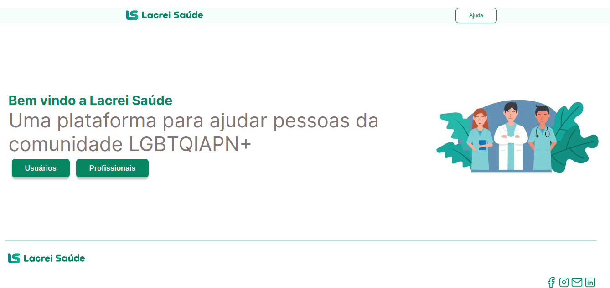
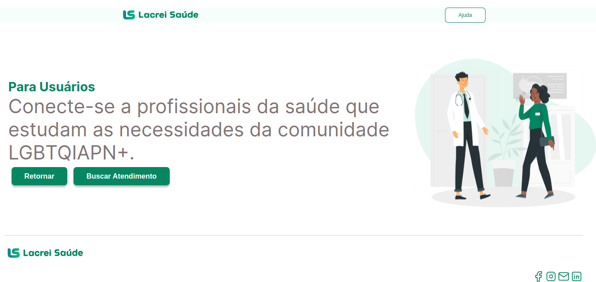
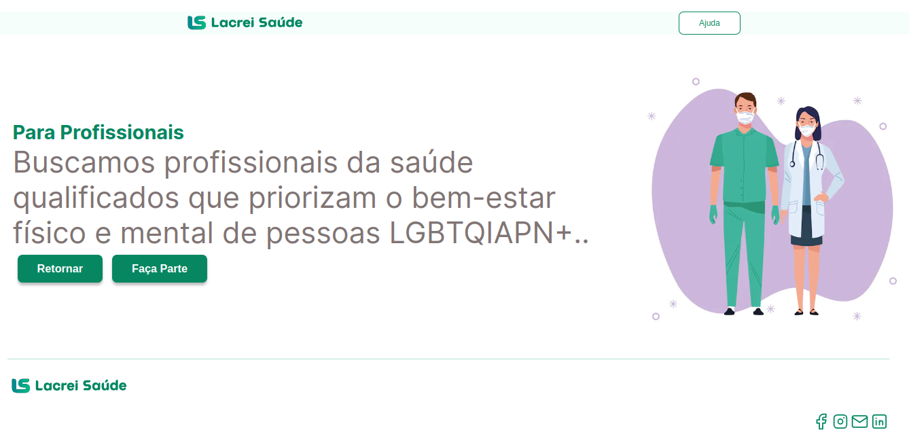

<div align="center">

# 🌈 Desafio de Voluntariado em Front End na Lacrei Saúde 🌟


</div>

## 📝 Sobre o Desafio

O desafio consiste em desenvolver uma aplicação web utilizando next, são duas páginas web interativas, com roteamento entre elas

## 🚀 Deploy da Aplicação

A aplicação foi hospedada na Vercel, e você pode acessá-la clicando [aqui](https://desafio-lacrei-saude-swart.vercel.app/)

## Instalação 💻

Clone este repositório

```bash
  git clone git@github.com:ElieltonRamos/Desafio-Lacrei-Saude.git
```

Vá para o diretório do projeto

```bash
  cd Desafio-Lacrei-Saude
```

Instale as dependências

```bash
  npm install
```

Inicie o servidor

```bash
  npm run dev
```

Abra [http://localhost:3000](http://localhost:3000) no seu navegador para ver o resultado.

## 🧪 Testes

Para rodar os testes, execute o comando

```bash
  npm run test
```

Veja a saida dos testes no terminal

Para ver a cobertura de testes, execute o comando

```bash
  npm run coverage
```

Veja a cobertura de testes no terminal

## 📸 Screenshots 📸





## 🛠 Tecnologias

- [Next.js](https://nextjs.org/)
- [React](https://pt-br.reactjs.org/)
- [Styled Components](https://styled-components.com/)
- [Typescript](https://www.typescriptlang.org/)
- [Eslint](https://eslint.org/)
- [Jest](https://jestjs.io/)
- [Testing Library](https://testing-library.com/)

## 📝 Licença

Este repositorio e open-source e está sob a licença MIT. Fique a vontade para utilizá-lo da forma que desejar.

## 📬 Contato

- Email: Elieltonramos14@gmail.com
- Linkedin: [Elielton Ramos](https://www.linkedin.com/in/elielton-ramos/)

## 🙏 Agradecimentos

Agradeço a oportunidade a [Lacrei Saude](https://lacreisaude.com.br/), foi uma experiência incrível e aprendi muito durante o desenvolvimento do projeto.